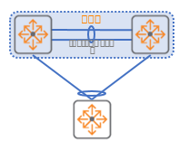

# ArubaOS-CX

---

참고 : [https://egstory.net/category/edge-study/tech-lesson/aos-cx-switching/](https://egstory.net/category/edge-study/tech-lesson/aos-cx-switching/)

[**VSF**](ArubaOS-CX/VSF%207cf7e35f71414fe590959be6715b2be2.md)

ArubaOS-CX 기본소개

CLI 접속 : Baud Rate 115200, Data bits 8, Parity No, Stop bits 1, Flow Control Off

초기 콘솔접속 :  admin, PW 없음

명령어 확인방법 : ? 입력

Checkpoint 생성 및 확인방법

생성 : copy running-config checkpoint chk01

확인 : show checkpoint list

스위치 운영체계 이미지구성 : Primary / Secondary image

기본 이미지 설정 명령어 : boot set-default [primary/secondary]

LACP (Link Aggregation Control Protocol)

최대 포트 수 1~8개

Keep alive

고려사항 : 속도, Duplex mode & link 상태

연결되는 장치 간의 입력값이 똑같이 입력되어야 함. (interface까지)

 예시

> interface lag 1
no shutdown
no routing
lacp mode active

interface 1/1/1
no shutdown
mtu 2048
lag 1

interface 1/1/2
no shutdown
mtu 2049
lag 1
> 

포트 상태정보 확인 명령어

show lacp aggregates → lacp  입력정보

show lacp interfaces → lacp 링크 상태 확인

<실습>

가상 환경에서 2인 1조로 한 개의 VSX 구성하기

가상 스위치는 예시에 맞게 링크

**VSX(Virtual Switching eXtension)** 설정

[ArubaOS-CX 10.04 Virtual Switching Extension (VSX) Guide 6400, 8320, 8325, 8400 Switch Series](https://techhub.hpe.com/eginfolib/Aruba/OS-CX_10.04/5200-6728/index.html#GUID-100ADC8E-1CF0-494C-A859-0859FAC652AA.html)

구성요소
ISL (Inter Switch Link) : 스위치 간의 연결부분
VSX LAG : LACP 구현에서 static/active 형태 지원
VSX Keepalive : 장애 시 secondary VSX LAG 사이 물리적인 포트를 비활성화
Active-Gateway
Active-Forwarding
PIM Dual-DR
Linkup-Delay

가상화 환경에서 사용 되는 지정된 유니캐스트 MAC 주소 사용

- 로컬 세그먼트에서 사용 할 수 있는 지정된 유니캐스트 MAC 주소 범위
x2-xx-xx-xx-xx-xx
x6-xx-xx-xx-xx-xx
xA-xx-xx-xx-xx-xx
xE-xx-xx-xx-xx-xx

구성 명령어

> qos trust dscp
interface lag 256
no shutdown
description ISL link
no routing
vlan trunk native 1
vlan trunk allowed all
lacp mode active
interface 1/1/55(임의설정)
no shutdown
mtu 9198
description ISL physical link
lag 256
interface 1/1/56
no shutdown
mtu 9198
description ISL physical link
lag 256
vrf KA
interface 1/1/48
no shutdown
vrf attach KA
description VSX keepalive
ip address 192.168.0.0/31

vsx
system-mac 02:01:00:00:01:00
inter-switch-link lag 256
role [primary/secondary]
vsx-sync vsx-global
keepalive peer 192.168.0.1 source 192.168.0.0 vrf KA
> 

VLAN

Access&Trunk 구성

> interface 1/1/1
no routing → 기본적으로 VLAN1에 할당됨
no shutdown
vlan trunk allowed 13-14 → 해당 인터페이스 트렁크설정 및 vlan 13, 14 허용

vlan trunk allowed all → 모든 vlan 허용 시
> 

Vlan Interface 구성

> interface vlan 13
vrf attach vrf13
ip address 10.1.3.252/24
> 

**routing 명령어 사용하려면**

`system internal-vlan-range 4041-4094`

이후 `routing` 입력 ⇒ L3로 변함

참고 : [https://www.arubanetworks.com/techdocs/AOS-CX/10.07/HTML/5200-7852/Content/Chp_VLANs/VLAN_cmds/sys-int-vla-ran-gl-tl-10.htm](https://www.arubanetworks.com/techdocs/AOS-CX/10.07/HTML/5200-7852/Content/Chp_VLANs/VLAN_cmds/sys-int-vla-ran-gl-tl-10.htm)

routing 사용 시 vlan trunk & allowed 사용 불가

**ACL(access-list) (매뉴얼파일 p.261)**

`access-list ip [NAME]` → 이름 정하면 편함

`[순서] [permit/deny] [tcp/udp/icmp/…] [source ip] [destination ip] count`

*****순서(넘버) 유의

기본적으로 deny

ACL 설정 후 적용할 인터페이스 접속

`interface 1/1/[]`

`apply access-list ip [name] [in/out]`

ACL hitcount 확인

`show access-list hitcounts ip [NAME]`

참고 : [https://www.arubanetworks.com/techdocs/AOS-CX/10.08/HTML/acls_4100i-6000-6100/Content/Chp_ACLs/acl-usa-tip.htm](https://www.arubanetworks.com/techdocs/AOS-CX/10.08/HTML/acls_4100i-6000-6100/Content/Chp_ACLs/acl-usa-tip.htm)