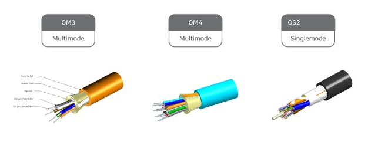

# Ethernet

---

- **참고**
    - [**https://ko.wikipedia.org/wiki/이더넷**](https://ko.wikipedia.org/wiki/%EC%9D%B4%EB%8D%94%EB%84%B7)
    - [**https://m.blog.naver.com/jchyuncorp/222033619668**](https://m.blog.naver.com/jchyuncorp/222033619668)
- LAN(근거리 통신망), WAN(원거리 통신망), MAN(도시권 통신망) 에서 가장 많이 활용되는 기술 규격
- 물리계층에서의 역할 ⇒ 신호, 배선
    - 동축케이블 → 현재 거의 사용X
    - 광케이블 → 유리섬유
        - 동축케이블보다 가벼움, 대역폭 기가급
        - 전송 손실 매우 낮음
        - 수명은 반영구적
        - 전송오차 적음
            
            → 고속 데이터 송수신+높은 신뢰도 필요할 때 씀
            
        
        
        
    - STP케이블 → 차폐(실드o) 꼬임쌍선
        - 신호 간섭이 많은 공장/야외/빠른 통신속도가 필요한 곳
        - 유럽에서 주로 씀
    - UTP케이블 → 비차폐(실드x) 꼬임쌍선 Category 6,5,5e 케이블
        - 전화선이나 이더넷 등에 많이 씀
        - 처리가 간단, 값이 쌈, 빠른전송 필요x → 랜 용도에서 표준적
        
        
        
- 데이터링크계층에서의 역할 ⇒ MAC(Media Access Control)패킷, 프로토콜 형식 정의
- IEEE 802.3 규약, 현재 가장 메이저
- 사용 기술 ⇒ [CSMA/CD](Ethernet/CSMA%20CD%20957d9e5715c04d3f8acef2f02511256a.md) 방식

- **관련 문서**
    
    [**CSMA/CD**](Ethernet/CSMA%20CD%20957d9e5715c04d3f8acef2f02511256a.md)