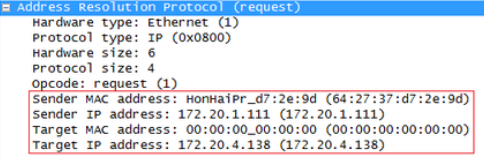

# ARP

---

- **참고**
    - [**https://ko.wikipedia.org/wiki/주소_결정_프로토콜**](https://ko.wikipedia.org/wiki/%EC%A3%BC%EC%86%8C_%EA%B2%B0%EC%A0%95_%ED%94%84%EB%A1%9C%ED%86%A0%EC%BD%9C)
    - [**https://coding-factory.tistory.com/720**](https://coding-factory.tistory.com/720)
    - [**https://bannavi.tistory.com/147**](https://bannavi.tistory.com/147)
    - [**http://www.ktword.co.kr/test/view/view.php?m_temp1=10**](http://www.ktword.co.kr/test/view/view.php?m_temp1=10)
    - [**https://m.blog.naver.com/PostView.nhn?blogId=sujunghan726&logNo=220322717607&proxyReferer=https:%2F%2Fwww.google.com%2F**](https://m.blog.naver.com/PostView.nhn?blogId=sujunghan726&logNo=220322717607&proxyReferer=https:%2F%2Fwww.google.com%2F)
    - [**https://noodles8436.tistory.com/6**](https://noodles8436.tistory.com/6)
- OSI 7계층에서 2계층과 3계층 사이에 속하는 프로토콜 MAC 주소와 IP주소 둘 다 사용하기 때문
- ARP : 주소 결정 프로토콜. 네트워크상에서 IP주소를 MAC주소로 대응시키기 위해 사용함
- 2계층(데이터링크)에 속하는 프로토콜 : [**Ethernet**](../Layer2%20(Data%20Link)/Ethernet%2005aeacf5fc184161a8ad19adbc19dd9f.md)
- 논리 주소 = IP주소
- 물리 주소 = MAC주소
- 두 노드는 MAC 주소를 알기 전까지 통신할 수 없음
→ MAC주소를 알아내기 위해서 사용하는 게 ARP
- ARP 패킷 정보형식
    
    
    
    PC에서 Wireshark를 이용해서 받은 패킷 덤프
    
    
    
- 통신을 시도할 때 출발지와 목적지 IP주소는 미리 알고 있어서 3계층 캡슐화하는 데는 문제가 없지만 상대방의 MAC주소를 알 수 없어서 2계층 캡슐화를 수행할 수 없다. 아래와 같은 ARP 동작방식을 통해서 상대방의 MAC주소를 알아내야 2계층 캡슐화를 수행할 수 있다.
- ARP **동작 (인캡슐레이션 방식)**
출발지에서 목적지IP로 ARP Request packet을 보낸다 ⇒ 스위치에서 출발지의 IP주소와 MAC주소, 목적지IP를 파악해서 ARP Table을 만들고 ARP Request(MAC Broadcast)를 한다. ⇒ 그 Packet을 받은 근방의 시스템들이 각자의 IP가 맞는지 확인하는데 그 중에서 해당되는 시스템이 아니라면 Packet을 버리고, 해당되는 시스템이라면 ARP Request Packet을 받고 출발지 노드에 Unicast로 ARP Reply한다.
- CMD 창에서 `arp -a` 명령어 입력 시 PC의 ARP 테이블 정보를 확인할 수 있다.
- ARP 테이블은 일정 시간 동안 통신이 없으면 자동으로 삭제된다
- 네트워크 장비에서의 ARP는 하드웨어 가속이 아니라 CPU에서 직접 수행하기 때문에 짧은 시간에 많은 ARP 요청이 들어오는게 큰 부하로 작용한다. 그래서 다량의 ARP 패킷을 이용한 공격 사례가 많았으나 이런 공격에 대응하기 위해 ARP 테이블 저장 기간을 일반 PC보다 길게 설정(캐시)하고, 많은 요청이 들어오면 필터링하거나 천천히 처리하는 방식으로 장비의 부하를 방지한다.
ARP 테이블을 수동으로만 갱신하도록 설정해서 운영하기도 한다.
- **보안문제**
    - ARP정보를 누가 보냈는지 검증할 수 있는 수단이 없다
    - 같은 네트워크 상에 있는 사용자가 변조된 정보를 보낼 경우
    → 그 정보를 받은 사용자는 잘못된 맥 주소로 패킷을 보내고
    ⇒ 이를 이용해서 ARP 스푸핑 공격을 받을 가능성이 있다

- 관련 문서
    
    [RARP](ARP/RARP%20856599661ba943f08626ead7ccc23b28.md)
    
    [Proxy ARP](ARP/Proxy%20ARP%20f1aaa8ba8b5f405f814fbaf45675a1c8.md)
    
    [GARP (Gratuitous ARP)](ARP/GARP%20(Gratuitous%20ARP)%20e0eeeb9f3dcc4d4c83e03ef421f560ed.md)