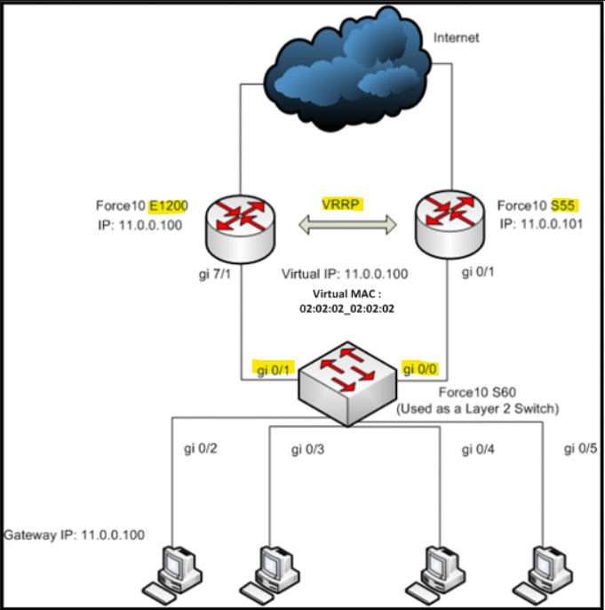

# VRRP

---

- **참고**
    
    [**https://humairahmed.com/blog/?p=2058**](https://humairahmed.com/blog/?p=2058)
    
    [**https://m.blog.naver.com/PostView.naver?isHttpsRedirect=true&blogId=goduck2&logNo=220162690234**](https://m.blog.naver.com/PostView.naver?isHttpsRedirect=true&blogId=goduck2&logNo=220162690234)
    
    [**https://investigate.tistory.com/109**](https://investigate.tistory.com/109)
    
- OSI 3계층, 표준(IEEE)
- 로드밸런싱 불가
- 

---

- [GARP](Layer3%20(Network)/ARP/GARP%20(Gratuitous%20ARP)%20e0eeeb9f3dcc4d4c83e03ef421f560ed.md)를 이용해 VRRP 갱신하는 순서
    
    
    
1. (E1200이 Active 한 상황) Host 장비들이 Gateway IP(11.0.0.100)으로 ARP Request를 보내면 스위치는 수신포트를 제외한 다른 모든 포트로 브로드캐스트 한다
2. E1200이 해당 ARP Request Packet에 대해 Virtual MAC Address를 이용해서 ARP Reply를 보낸다
3. ARP Reply를 수신한 스위치는 Virtual MAC address의 포트정보(G0/1) 확인 후 Mac Table Entry를 만든다
4. ARP Reply를 수신한 Host들은 ARP Table에 Virtual IP,MAC address를 매핑하여 등록한다
5. 만약 E1200에 장애가 발생하여 S55가 Active되면 바로 Virtual IP, MAC을 이용해서 GARP를 송신한다
6. GARP를 수신한 스위치는 Virtual MAC address가 기존 포트가 아닌 G0/0이라는 걸 확인하고 기존 MAC Table Entry의 포트정보를 G0/0으로 업데이트한다.
    1. Host들은 Virtual IP,MAC이 바뀌는 게 아니므로 아무런 변화 없다

---