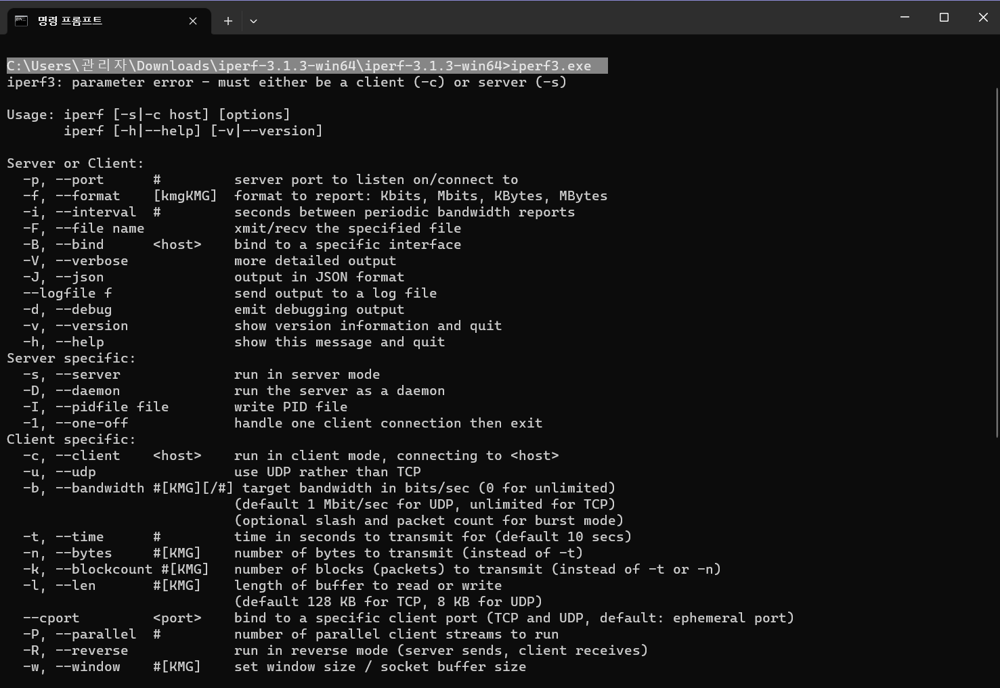

# iperf3

---

다운로드 링크 : [https://iperf.fr/iperf-download.php#windows](https://iperf.fr/iperf-download.php#windows)

기본 설명 : [https://blog.naver.com/daouidc/223139190468](https://blog.naver.com/daouidc/223139190468)

상세 설명 : [https://appia.tistory.com/606](https://appia.tistory.com/606)

bps, Kbps, Mbps 계산기 : [http://mwultong.blogspot.com/2008/01/bps-kbps-mbps-gbps-tbps-calculator.html](http://mwultong.blogspot.com/2008/01/bps-kbps-mbps-gbps-tbps-calculator.html)

트래픽 발생 용도로 통신확인할 때 씀

네트워크 성능과 대역폭을 측정할 수 있는 툴

프로그램 다운로드를 한다.

다운로드 된 경로를 복사해놓는다.

CMD를 켠다

cd [다운로드 된 경로] 명령어를 입력한다.

iperf3.exe 명령어를 입력해본다.

대충 이런 식으로 나오면 프로그램 실행성공임

[서버모드 설정]

iperf3.exe -s [지정하고 싶은 서버 ip입력. 없으면 현 PC ip로 자동지정됨]

리스닝상태가 되면 서버모드 설정 완료

[클라이언트모드 설정]

iperf3.exe -c [현재 클라이언트 ip 필수] ←서버 ip로 지정해야 함 (출발지는 현 PC ip)

[결과]

출발지 출력값

서버 출력값

fortigate용 대역폭 테스트 하는 법

[https://ebt-forti.tistory.com/54](https://ebt-forti.tistory.com/54)